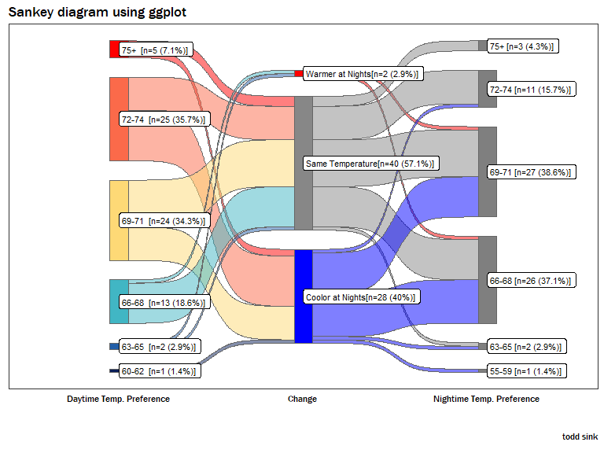

## README

## Overview

A Google Survey was distributed on Facebook asking for responses to two
questions regarding the heat of Spring and Summer:

1.  What is the ideal **DAYTIME** thermostat temperature range (degrees
    Fahrenheit) for your home?

2.  What is the ideal **NIGHTTIME** thermostat temperature range
    (degrees Fahrenheit) for your home?

A total of 81 responses were received.

### Graph Interpretation

The graph provided at the bottom of this page shows the results of the
two question survey. This section provides a quick overview on how to
interpret the graph.

**Daytime Temp. Preference:** The left side of the graph shows the
selections made for the preferred **DAYTIME** temperature range. The
labels display the option and the number and percentage of people who
made the choice.

**Daytime-to-Nighttime Change** The center of the graph shows the
change, if any, that was made between preferred daytime and nighttime
temperature ranges. The size of the bars are proportional to the number
of responses.

**Nighttime Temp. Preference** The right side of the graph shows the
selections made for the preferred **NIGHTTIME** temperature range. The
labels display the option and the number and percentage of people who
made the choice.

### Results–Home Temperature Preference

**Daytime:** There is a tie for the most preferred temperature range
during the daytime. The temperature ranges 72-74 and 69-71 each received
a 32.1% share of the responses. The temperature range 66-68 is preferred
by 23.5% of the respondents. The remaining preferences are as follows:

-   75+ (7.4%)
-   63-65 (2.5%)
-   60-62 (2.5%)

**Daytime/Nighttime Change:** The majority of respondents, 59.3%, prefer
to leave the thermostat setting the same for the daytime and nighttime.
Approximately 37% prefer the home temperature to be cooler at nights and
3.7% prefer it to be warmer at nights.

**Nighttime:** There is a near tie for the most preferred temperature
range during the nighttime. The temperature range 69-71 is the most
preferred with 37% of responses. The temperature range 66-68 is a close
second with 35.8% of responses. The remaining preferences are as
follows:

-   75+ (4.9%)
-   72-74 (14.8%)—Highly preferred during the daytime.
-   63-65 (3.7%)
-   60-62 (2.5%)
-   55-59 (1.2%)

